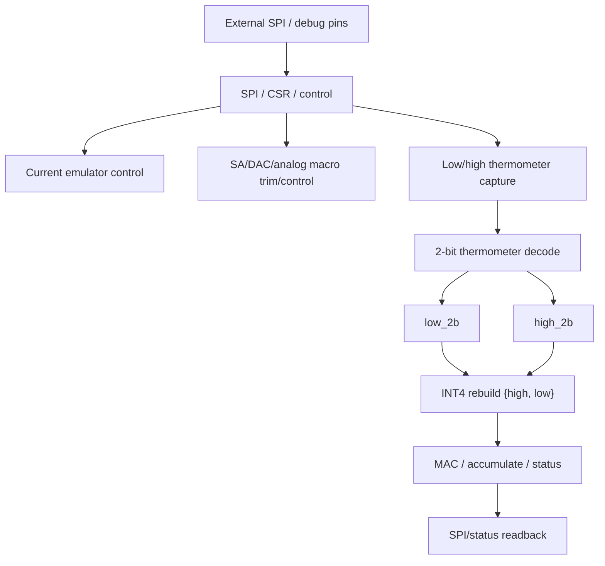

# Controller for IGZO DRAM

Frontend RTL, verification collateral, and behavioral models for an SMIC 0.18um CMOS controller targeting monolithic 3D IGZO DRAM research.

This repository focuses on the controller/readout side of the project. It excludes foundry PDKs, proprietary IO libraries, Calibre/Pegasus rule decks, GDS databases, and private tapeout collateral.

## What Is IGZO DRAM?

IGZO DRAM uses indium gallium zinc oxide thin-film transistors as memory access or storage devices. IGZO TFTs offer very low off-state leakage, BEOL-compatible low-temperature processing, and monolithic 3D integration potential above CMOS logic. These properties make IGZO attractive for dense memory arrays with long retention, low standby power, and analog/multi-level storage.

In a multi-level IGZO memory concept, one cell can be programmed and sensed at several distinct current or conductance levels instead of only binary 0/1 states. A 4-bit/cell target would require 16 reliably separable levels. That is attractive for density and in-memory-compute weight storage, but it is also much harder for a first silicon vehicle because the usable current window must survive device variation, retention drift, parasitics, sense-amplifier/DAC mismatch, and PVT corners.

This project therefore uses a risk-reduced validation target: robust four-level sensing, or 2-bit/cell, while the digital controller reconstructs INT4 values from two 2-bit slices. In this project, the CMOS die acts as the controller/readout/test platform for future BEOL IGZO memory integration.

## Design Concept

The current risk-reduced chip target separates **memory-state sensing** from
**INT4 weight reconstruction**.

Instead of asking one IGZO cell to provide 16 reliably distinguishable current
levels, this validation chip only asks one cell/slice to provide four current
levels. Four levels correspond to a 2-bit symbol:

```text
one IGZO cell/slice -> 4 analog current levels -> 2-bit symbol {0,1,2,3}
```

An INT4 weight is then represented by two such 2-bit symbols:

```text
low_2b  = lower two bits of the INT4 weight
high_2b = upper two bits of the INT4 weight

INT4[3:0] = {high_2b[1:0], low_2b[1:0]}
          = low_2b + 4 * high_2b
```

The analog front-end therefore only needs robust four-level current sensing for
each slice. The full 4-bit value is reconstructed in the digital controller by
capturing the low/high thermometer outputs, decoding each into a 2-bit symbol,
and concatenating the two symbols into one INT4 word.

This is the main first-silicon risk reduction: the chip can validate the IGZO
readout path with a 2-bit/cell target while still exposing an INT4 digital
interface to the MAC and status/readback logic.

## System Architecture



## 2-bit/cell Targets

This validation chip uses four target read-current levels for the 2-bit/cell path:

| Symbol | WBL/VSN target | Target IRBL |
|---:|---:|---:|
| 0 | 0.35 V | 0.254 uA |
| 1 | 0.60 V | 1.925 uA |
| 2 | 0.85 V | 4.850 uA |
| 3 | 1.10 V | 8.250 uA |

Reference thresholds:

| Threshold | Current |
|---|---:|
| T01 | 1.089 uA |
| T12 | 3.388 uA |
| T23 | 6.550 uA |

## Repository Layout

```text
rtl/             SystemVerilog RTL for the digital controller
tb/              Directed Verilog testbenches
constraints/     Timing constraints for digital_top
models/          IGZO behavioral, retention, margin, and INT4 readout models
docs/            Public design, interface, validation, and BEOL integration docs
```

## Main RTL Blocks

```text
digital_top.sv
spi_slave.sv
regfile.sv
act_regfile.sv
adc_decoder_2b.sv
int4_rebuild.sv
dequant_unit.sv
bitserial_mac.sv
accum26.sv
row_seq.sv
bist_ctrl.sv
fsm_debug.sv
activation_shift_ctrl.sv
scan_bypass_mux.sv
```

## Key Interfaces

- SPI control and status register access
- BIST and debug status observation
- low/high 2-bit slice thermometer inputs from current-sense ADC macros
- INT4 rebuild path
- bit-serial MAC / accumulator path
- scan and bypass hooks for bring-up

## Documentation

Start with:

```text
docs/README.md
docs/design/architecture_and_specs_v1.md
docs/interfaces/register_map_v1.md
docs/interfaces/pad_list_v1.md
docs/validation/bringup_procedure_v1.md
```

## Status

- RTL source tree and directed testbenches are included.
- Behavioral IGZO write/read, retention, ML-SA margin, and INT4 readout models are included.
- A separate internal handoff package contains backend Innovus evidence; that package is not fully mirrored here because it contains generated physical-design collateral.
- Foundry signoff is not included in this public repository.

## License

See [LICENSE](LICENSE).
